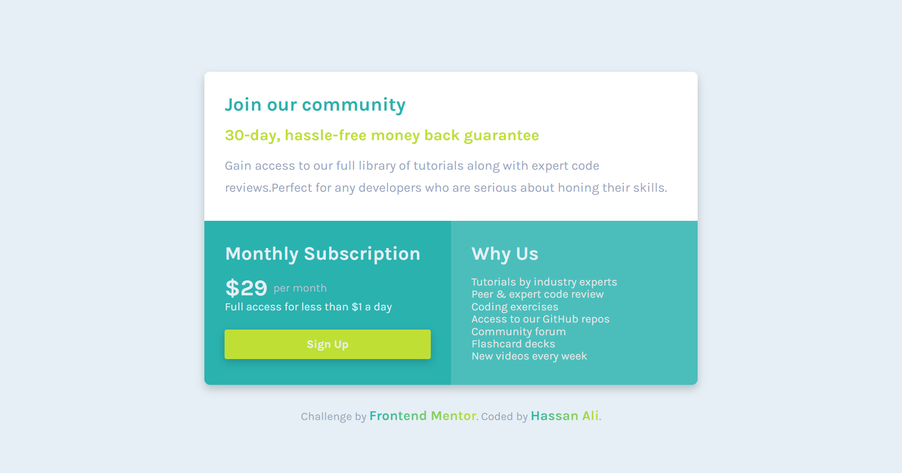

# Frontend Mentor - Single Price Grid Component Solution

This is my solution to the [Single Price Grid Component](https://www.frontendmentor.io/challenges/single-price-grid-component-5ce41129d0ff452fec5abbbc) on Frontend Mentor.  
Frontend Mentor challenges help you practice building realistic, production-ready web components.

---

## 📌 Overview

### 🔹 The Challenge

Users should be able to:

- View the **price grid component** layout optimally depending on their device’s screen size.  
- See hover and focus states for interactive elements.   

---

## 🖼️ Screenshots

### Desktop

### Mobile

---

## 🌐 Live Demo

👉 [View Live Demo](https://hassan-ali-byte.github.io/single-price-grid-component-main/)

---

## ⚙️ My Process

### Built With

- ✅ Semantic **HTML5 markup** (`<main>`, `<section>`, `<ul>`, `<button>`)  
- 🎨 **CSS custom properties (variables)** for colors, spacing, and fonts  
- 📐 **CSS Grid + Flexbox hybrid** for layout control  
- ⚡ Modern CSS features: `clamp()`,  and responsive units (`em`, `rem`)  
- 🎯 Accessibility improvements with proper heading hierarchy and focus states  

---

## 📚 What I Learned

This challenge helped me strengthen my understanding of **CSS Grid** and **responsive design**:

- **CSS Grid for Layout**  
  Used `grid-template-columns` and `grid-column: span 2;` to build a clean, responsive grid.  

- **Focus vs Focus-Visible**  
  Practiced the difference:  
  - `:focus` → triggers on all interactions (mouse + keyboard).  
  - `:focus-visible` → triggers only for keyboard navigation, improving UX.  

## 🔗 Resources

- [Josh Comeau – CSS Reset](https://www.joshwcomeau.com/css/custom-css-reset/)  
- [Kevin Powell – Grid Tutorial](https://www.youtube.com/@KevinPowell)  

---

## 👨‍💻 Author

**Hassan Ali**  

- Frontend Mentor – [@hassan-ali-byte](https://www.frontendmentor.io/profile/hassan-ali-byte)  
- GitHub – [hassan-ali-byte](https://github.com/hassan-ali-byte)  

---

✨ Thanks for checking out my solution!  
Feedback and suggestions are always welcome 🙌
